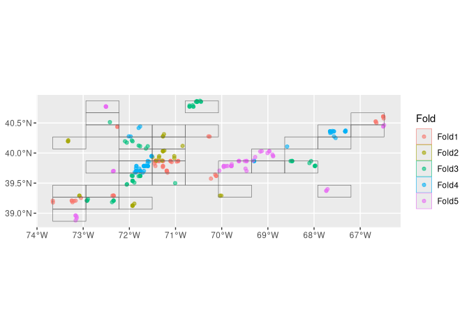
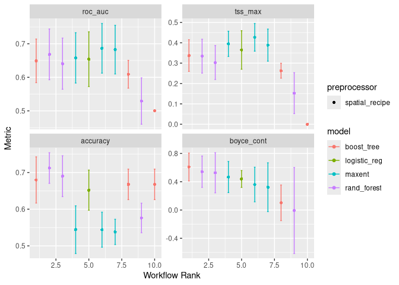
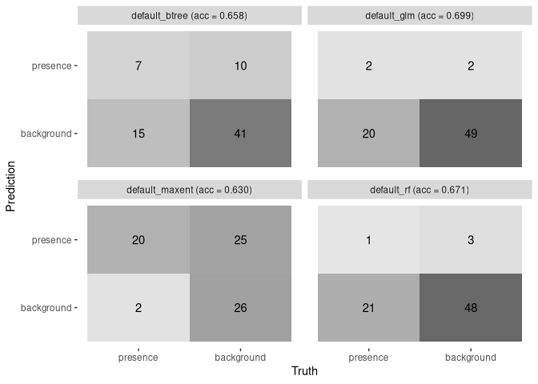
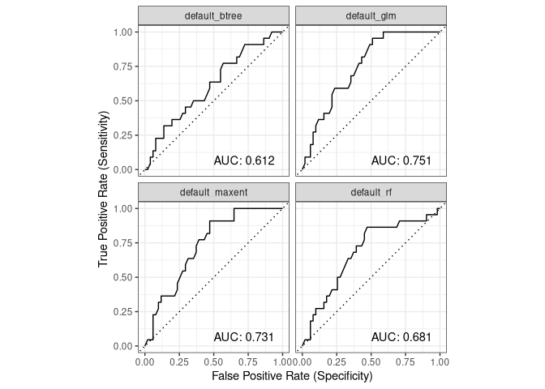
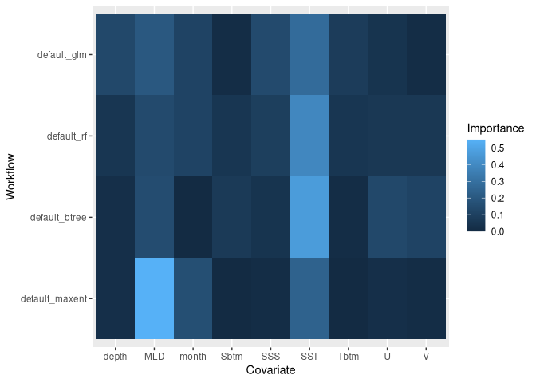
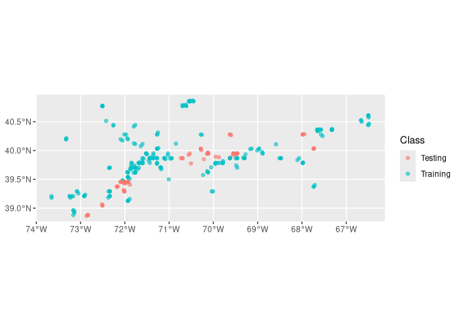
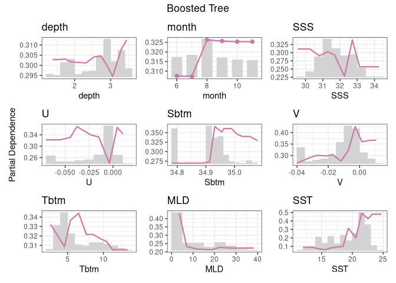

Second Species Model
================

``` r
source("/home/canura26/ColbyForecasting/setup.R")
for (f in list.files("/home/canura26/ColbyForecasting/functions",
     pattern = glob2rx("*.R"), full.names = TRUE)){
  source(f)
}

SPECIES = "Galeocerdo cuvier"
```

``` r
cfg = read_configuration(scientificname = SPECIES, version = "v1")
model_input = read_model_input(scientificname = SPECIES, 
                               version = "v1",
                               log_me = c("depth", "Xbtm")) |>
  dplyr::mutate(month = month_as_number(.data$month)) |>
  select(all_of(c("class", cfg$keep)))
```

``` r
model_input_split = spatial_initial_split(model_input, 
                        prop = 1 / 5,     # 20% for testing
                        strategy = spatial_block_cv) # see ?spatial_block_cv
model_input_split
```

    ## <Training/Testing/Total>
    ## <217/117/334>

``` r
autoplot(model_input_split)
```

<!-- -->

``` r
tr_data = training(model_input_split)
cv_tr_data <- spatial_block_cv(tr_data,
  v = 5,     
  cellsize = grid_cellsize(model_input),
  offset = grid_offset(model_input) + 0.00001
)
autoplot(cv_tr_data)
```

<!-- -->

``` r
one_row_of_training_data = dplyr::slice(tr_data,1)
rec = recipe(one_row_of_training_data, formula = class ~ .)
rec
```

    ## 

    ## ── Recipe ──────────────────────────────────────────────────────────────────────

    ## 

    ## ── Inputs

    ## Number of variables by role

    ## outcome:   1
    ## predictor: 9
    ## coords:    2

``` r
summary(rec)
```

    ## # A tibble: 12 × 4
    ##    variable type      role      source  
    ##    <chr>    <list>    <chr>     <chr>   
    ##  1 depth    <chr [2]> predictor original
    ##  2 month    <chr [2]> predictor original
    ##  3 SSS      <chr [2]> predictor original
    ##  4 U        <chr [2]> predictor original
    ##  5 Sbtm     <chr [2]> predictor original
    ##  6 V        <chr [2]> predictor original
    ##  7 Tbtm     <chr [2]> predictor original
    ##  8 MLD      <chr [2]> predictor original
    ##  9 SST      <chr [2]> predictor original
    ## 10 X        <chr [2]> coords    original
    ## 11 Y        <chr [2]> coords    original
    ## 12 class    <chr [3]> outcome   original

``` r
wflow = workflow_set(
  
  preproc = list(default = rec), # not much happening in our preprocessor
  
  models = list(                 # but we have 4 models to add
    
      # very simple - nothing to tune
      glm = logistic_reg(
          mode = "classification") |>
        set_engine("glm"),
      
      # two knobs to tune
      rf = rand_forest(
          mtry = tune(),
          trees = tune(),
          mode = "classification") |>
        set_engine("ranger", 
                   importance = "impurity"),
      
      # so many things to tune!
      btree = boost_tree(
          mtry = tune(), 
          trees = tune(), 
          tree_depth = tune(), 
          learn_rate = tune(), 
          loss_reduction = tune(), 
          stop_iter = tune(),
          mode = "classification") |>
        set_engine("xgboost"),
    
      # just two again
      maxent = maxent(
          feature_classes = tune(),
          regularization_multiplier = tune(),
          mode = "classification") |>
        set_engine("maxnet")
  )
)
wflow
```

    ## # A workflow set/tibble: 4 × 4
    ##   wflow_id       info             option    result    
    ##   <chr>          <list>           <list>    <list>    
    ## 1 default_glm    <tibble [1 × 4]> <opts[0]> <list [0]>
    ## 2 default_rf     <tibble [1 × 4]> <opts[0]> <list [0]>
    ## 3 default_btree  <tibble [1 × 4]> <opts[0]> <list [0]>
    ## 4 default_maxent <tibble [1 × 4]> <opts[0]> <list [0]>

``` r
metrics = sdm_metric_set(yardstick::accuracy)
metrics
```

    ## A metric set, consisting of:
    ## - `boyce_cont()`, a probability metric | direction: maximize
    ## - `roc_auc()`, a probability metric    | direction: maximize
    ## - `tss_max()`, a probability metric    | direction: maximize
    ## - `accuracy()`, a class metric         | direction: maximize

``` r
wflow <- wflow |>
  workflow_map("tune_grid",
    resamples = cv_tr_data, 
    grid = 3,
    metrics = metrics, 
    verbose = TRUE)
```

    ## i    No tuning parameters. `fit_resamples()` will be attempted

    ## i 1 of 4 resampling: default_glm

    ## ✔ 1 of 4 resampling: default_glm (748ms)

    ## i 2 of 4 tuning:     default_rf

    ## i Creating pre-processing data to finalize 1 unknown parameter: "mtry"

    ## ✔ 2 of 4 tuning:     default_rf (5.3s)

    ## i 3 of 4 tuning:     default_btree

    ## i Creating pre-processing data to finalize 1 unknown parameter: "mtry"

    ## → A | warning: `early_stop` was reduced to 0.

    ## There were issues with some computations   A: x1                                                 → B | warning: the standard deviation is zero
    ## There were issues with some computations   A: x1There were issues with some computations   A: x2   B: x1There were issues with some computations   A: x3   B: x1There were issues with some computations   A: x4   B: x2There were issues with some computations   A: x5   B: x2There were issues with some computations   A: x6   B: x3There were issues with some computations   A: x7   B: x3There were issues with some computations   A: x8   B: x4There were issues with some computations   A: x9   B: x4There were issues with some computations   A: x10   B: x5There were issues with some computations   A: x10   B: x5
    ## ✔ 3 of 4 tuning:     default_btree (11.1s)
    ## i 4 of 4 tuning:     default_maxent
    ## ✔ 4 of 4 tuning:     default_maxent (2.1s)

``` r
autoplot(wflow)
```

    ## Warning: Removed 1 row containing missing values or values outside the scale range
    ## (`geom_point()`).

<!-- -->

``` r
model_fits = workflowset_selectomatic(wflow, model_input_split,
                                  filename = "Galeocerdo_cuvier-v1-model_fits",
                                  path = data_path("models"))
model_fits
```

    ## # A tibble: 4 × 7
    ##   wflow_id     splits            id    .metrics .notes   .predictions .workflow 
    ##   <chr>        <list>            <chr> <list>   <list>   <list>       <list>    
    ## 1 default_glm  <split [217/117]> trai… <tibble> <tibble> <tibble>     <workflow>
    ## 2 default_rf   <split [217/117]> trai… <tibble> <tibble> <tibble>     <workflow>
    ## 3 default_btr… <split [217/117]> trai… <tibble> <tibble> <tibble>     <workflow>
    ## 4 default_max… <split [217/117]> trai… <tibble> <tibble> <tibble>     <workflow>

``` r
model_fit_metrics(model_fits)
```

    ## # A tibble: 4 × 5
    ##   wflow_id       accuracy boyce_cont roc_auc tss_max
    ##   <chr>             <dbl>      <dbl>   <dbl>   <dbl>
    ## 1 default_glm       0.692      0.690   0.632   0.216
    ## 2 default_rf        0.658      0.686   0.648   0.322
    ## 3 default_btree     0.632      0.569   0.627   0.289
    ## 4 default_maxent    0.556      0.610   0.624   0.284

``` r
model_fit_confmat(model_fits)
```

<!-- -->

``` r
model_fit_roc_auc(model_fits)
```

<!-- -->

``` r
model_fit_varimp_plot(model_fits)
```

<!-- -->

``` r
rf = model_fits |>
  filter(wflow_id == "default_rf")
rf
```

    ## # A tibble: 1 × 7
    ##   wflow_id   splits            id      .metrics .notes   .predictions .workflow 
    ##   <chr>      <list>            <chr>   <list>   <list>   <list>       <list>    
    ## 1 default_rf <split [217/117]> train/… <tibble> <tibble> <tibble>     <workflow>

``` r
autoplot(rf$splits[[1]])
```

<!-- -->

``` r
rf$.metrics[[1]]
```

    ## # A tibble: 4 × 4
    ##   .metric    .estimator .estimate .config        
    ##   <chr>      <chr>          <dbl> <chr>          
    ## 1 accuracy   binary         0.658 pre0_mod0_post0
    ## 2 boyce_cont binary         0.686 pre0_mod0_post0
    ## 3 roc_auc    binary         0.648 pre0_mod0_post0
    ## 4 tss_max    binary         0.322 pre0_mod0_post0

``` r
rf$.predictions[[1]]
```

    ## # A tibble: 117 × 6
    ##    class      .pred_class .pred_presence .pred_background  .row .config        
    ##    <fct>      <fct>                <dbl>            <dbl> <int> <chr>          
    ##  1 presence   background          0.203             0.797     1 pre0_mod0_post0
    ##  2 presence   background          0.0406            0.959     5 pre0_mod0_post0
    ##  3 presence   background          0.0596            0.940     6 pre0_mod0_post0
    ##  4 background background          0.0611            0.939    10 pre0_mod0_post0
    ##  5 background background          0.169             0.831    11 pre0_mod0_post0
    ##  6 background background          0.126             0.874    13 pre0_mod0_post0
    ##  7 background background          0.235             0.765    14 pre0_mod0_post0
    ##  8 background background          0.127             0.873    16 pre0_mod0_post0
    ##  9 background background          0.0784            0.922    17 pre0_mod0_post0
    ## 10 background background          0.0216            0.978    18 pre0_mod0_post0
    ## # ℹ 107 more rows

``` r
rf$.workflow[[1]]
```

    ## ══ Workflow [trained] ══════════════════════════════════════════════════════════
    ## Preprocessor: Recipe
    ## Model: rand_forest()
    ## 
    ## ── Preprocessor ────────────────────────────────────────────────────────────────
    ## 0 Recipe Steps
    ## 
    ## ── Model ───────────────────────────────────────────────────────────────────────
    ## Ranger result
    ## 
    ## Call:
    ##  ranger::ranger(x = maybe_data_frame(x), y = y, mtry = min_cols(~9L,      x), num.trees = ~1000L, importance = ~"impurity", num.threads = 1,      verbose = FALSE, seed = sample.int(10^5, 1), probability = TRUE) 
    ## 
    ## Type:                             Probability estimation 
    ## Number of trees:                  1000 
    ## Sample size:                      217 
    ## Number of independent variables:  9 
    ## Mtry:                             9 
    ## Target node size:                 10 
    ## Variable importance mode:         impurity 
    ## Splitrule:                        gini 
    ## OOB prediction error (Brier s.):  0.2711682

``` r
model_fit_pdp(model_fits, wid = "default_btree", title = "Boosted Tree")
```

<!-- -->
