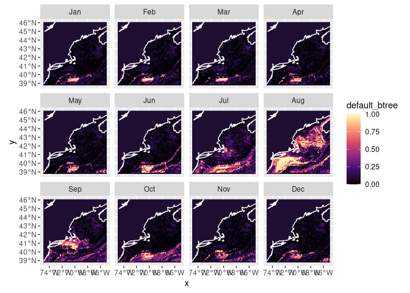
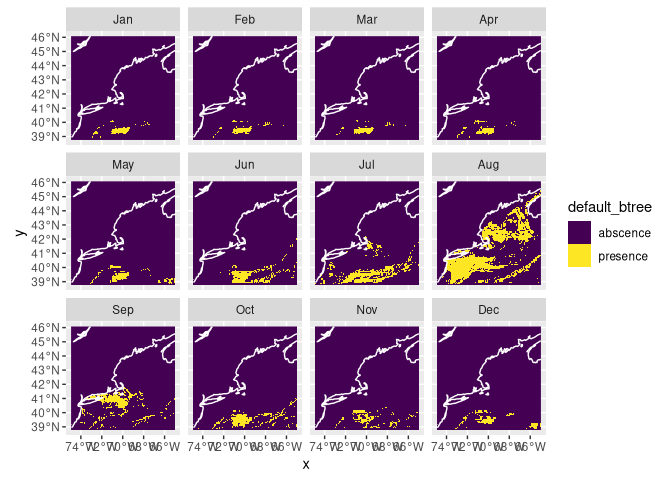
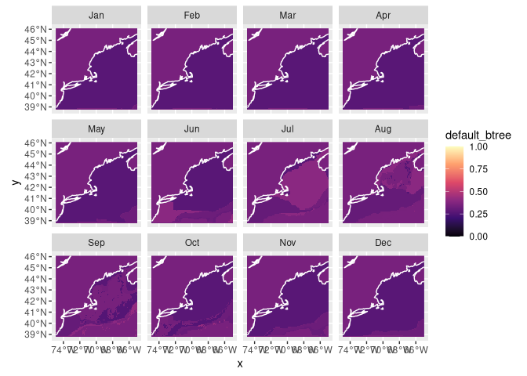

Second Species Prediction
================

``` r
cfg = read_configuration(scientificname = SPECIES,
                         version = "v1", 
                         path = data_path("models"))
db = brickman_database()
db = brickman_database()
present_conditions = read_brickman(db |> filter(scenario == "PRESENT", 
                                                interval == "mon"),
                       add = c("depth", "month")) |>
  select(all_of(cfg$keep_vars))
```

``` r
model_fits = read_model_fit(filename = "Galeocerdo_cuvier-v1-model_fits")
model_fits
```

    ## # A tibble: 4 × 7
    ##   wflow_id      splits           id    .metrics .notes   .predictions .workflow 
    ##   <chr>         <list>           <chr> <list>   <list>   <list>       <list>    
    ## 1 default_glm   <split [243/91]> trai… <tibble> <tibble> <tibble>     <workflow>
    ## 2 default_rf    <split [243/91]> trai… <tibble> <tibble> <tibble>     <workflow>
    ## 3 default_btree <split [243/91]> trai… <tibble> <tibble> <tibble>     <workflow>
    ## 4 default_maxe… <split [243/91]> trai… <tibble> <tibble> <tibble>     <workflow>

``` r
nowcast = predict_stars(model_fits, present_conditions)
nowcast
```

    ## stars object with 3 dimensions and 4 attributes
    ## attribute(s):
    ##                         Min.      1st Qu.       Median        Mean      3rd Qu.
    ## default_glm     2.220446e-16 2.220446e-16 2.220446e-16 0.003194937 2.220446e-16
    ## default_rf      8.482897e-02 1.777047e-01 2.454766e-01 0.305278114 4.351139e-01
    ## default_btree   2.566669e-01 2.692722e-01 3.480275e-01 0.314626207 3.480275e-01
    ## default_maxent  6.458839e-02 1.222313e-01 1.659243e-01 0.272835052 4.054566e-01
    ##                      Max.  NA's
    ## default_glm     0.9941650 59796
    ## default_rf      0.8447460 59796
    ## default_btree   0.4149275     0
    ## default_maxent  0.8800686 59796
    ## dimension(s):
    ##       from  to offset    delta refsys point      values x/y
    ## x        1 121 -74.93  0.08226 WGS 84 FALSE        NULL [x]
    ## y        1  89  46.08 -0.08226 WGS 84 FALSE        NULL [y]
    ## month    1  12     NA       NA     NA    NA Jan,...,Dec

``` r
plot_prediction(nowcast['default_btree'])
```

    ## numeric

<!-- -->

``` r
pa_nowcast = threshold_prediction(nowcast)
plot_prediction(pa_nowcast['default_btree'])
```

<!-- -->

``` r
covars_rcp85_2075 = read_brickman(db |> filter(scenario == "RCP85", 
                                               year == 2075, 
                                               interval == "mon"),
                                  add = c("depth", "month")) |>
  select(all_of(cfg$keep_vars))
```

``` r
forecast_2075 = predict_stars(model_fits, covars_rcp85_2075)
forecast_2075
```

    ## stars object with 3 dimensions and 4 attributes
    ## attribute(s):
    ##                         Min.      1st Qu.       Median        Mean      3rd Qu.
    ## default_glm     2.220446e-16 2.220446e-16 2.220446e-16 0.002669951 2.220446e-16
    ## default_rf      9.732302e-02 1.908306e-01 2.824399e-01 0.319596881 4.348506e-01
    ## default_btree   2.566669e-01 2.692722e-01 3.480275e-01 0.317935437 3.480275e-01
    ## default_maxent  6.461187e-02 1.284020e-01 1.882591e-01 0.311443084 4.987929e-01
    ##                      Max.  NA's
    ## default_glm     0.9896762 59796
    ## default_rf      0.8133607 59796
    ## default_btree   0.4149275     0
    ## default_maxent  0.9025561 59796
    ## dimension(s):
    ##       from  to offset    delta refsys point      values x/y
    ## x        1 121 -74.93  0.08226 WGS 84 FALSE        NULL [x]
    ## y        1  89  46.08 -0.08226 WGS 84 FALSE        NULL [y]
    ## month    1  12     NA       NA     NA    NA Jan,...,Dec

``` r
plot_prediction(forecast_2075['default_btree'])
```

    ## numeric

<!-- -->

``` r
# make sure the output directory exists
path = make_path("predictions")

write_prediction(nowcast,
                 scientificname = cfg$scientificname,
                 version = cfg$version,
                 year = "CURRENT",
                 scenario = "CURRENT")
write_prediction(forecast_2075,
                 scientificname = cfg$scientificname,
                 version = cfg$version,
                 year = "2075",
                 scenario = "RCP85")
```
